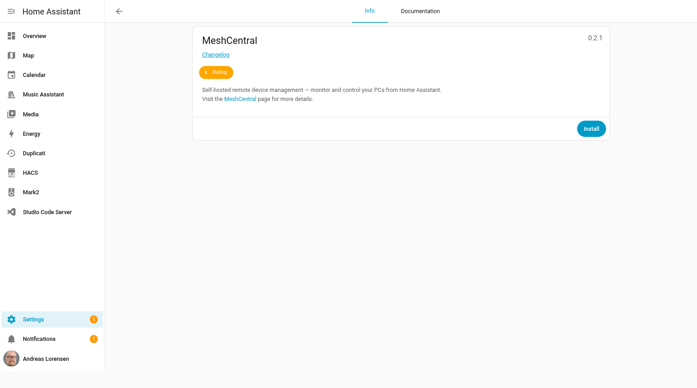
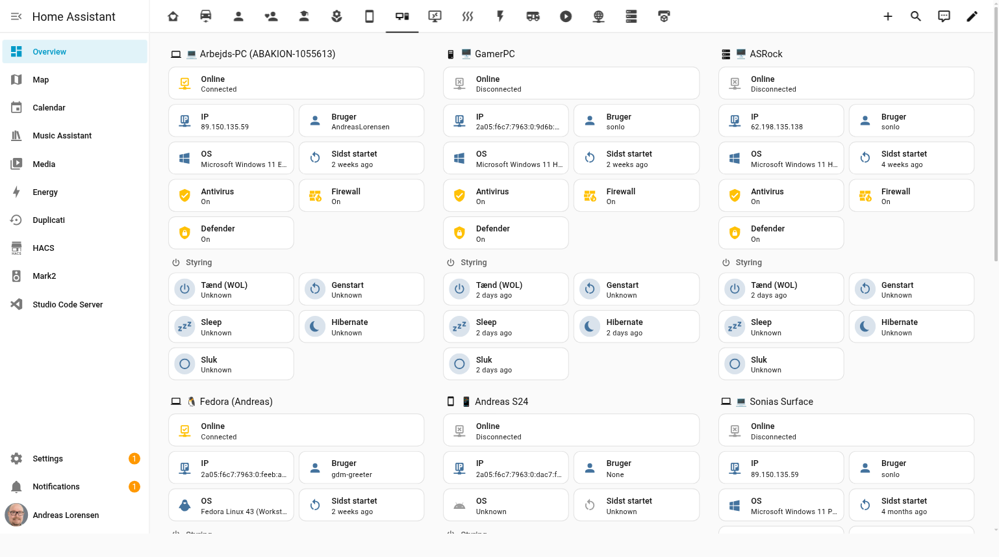
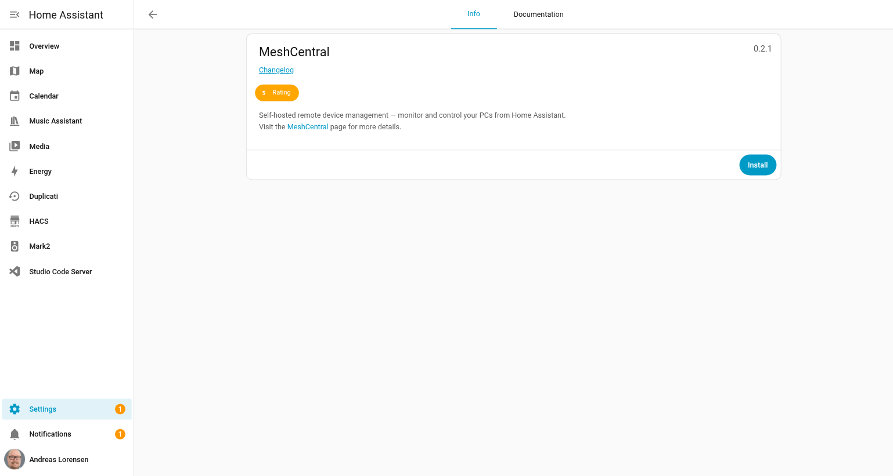
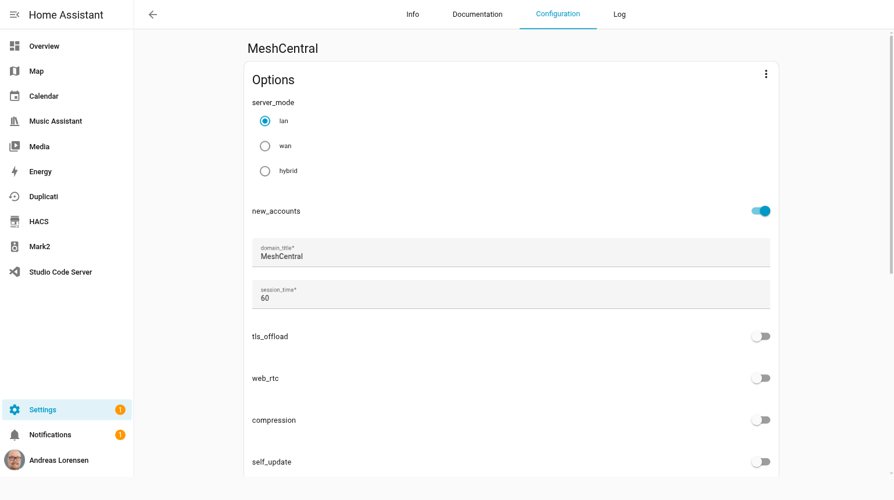
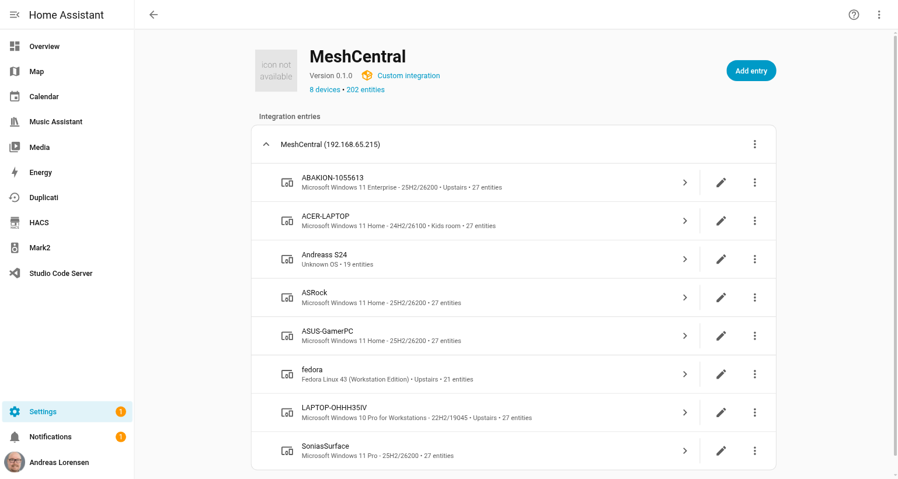

# MeshCentral Add-on for Home Assistant

[](https://github.com/andlo/ha-meshcentral-addon/releases)
[](LICENSE)
[](https://github.com/andlo/ha-meshcentral-addon/actions/workflows/build.yaml)

Run [MeshCentral](https://meshcentral.com) as a Home Assistant add-on — the free, open-source remote device management platform. Monitor and control all your Windows, Linux and macOS computers directly from Home Assistant.



## What is MeshCentral?

MeshCentral lets you remotely monitor, manage and control computers — think of it as your own private TeamViewer or AnyDesk, completely self-hosted, no subscriptions, no cloud dependency.

When combined with the [MeshCentral HA integration](https://github.com/andlo/ha-meshcentral), your PCs become first-class citizens in your smart home:

- See online/offline status in real-time
- Wake, reboot, sleep, hibernate or shut down devices from HA
- Automate based on PC state (turn on desk lamp when PC comes online, cut power when it shuts down)
- Monitor Windows Defender, firewall and antivirus status
- Hardware sensors: CPU, GPU, RAM, disk



## Quick start (local network)

This is all you need to get up and running on your local network:

1. **Add this repository** — go to **Settings → Add-ons → Add-on Store**, click ⋮ → **Repositories**, add `https://github.com/andlo/ha-meshcentral-addon`
2. **Install MeshCentral** from the store
3. **Start the add-on** — default settings work out of the box for local use
4. **Open the web interface** — see [Connecting to MeshCentral](#connecting-to-meshcentral) below
5. **Create your admin account** — account creation is enabled by default on first run
6. **Disable new accounts** — go to the add-on **Configuration** tab, set `new_accounts` to `false`, restart the add-on
7. **Install agents** on your computers — go to **My Devices → Add Device** in MeshCentral

That's it. No JSON editing required.





## Connecting to MeshCentral

MeshCentral runs its own HTTPS server with a self-signed certificate. When you start the add-on, the **Log** tab will show the exact URLs:

```
 Open in browser (accept certificate warning):
   https://192.168.x.x:4430
 Or via HTTP redirect:
   http://192.168.x.x:4431
```

The easiest way to connect is via **HTTP on port 4431** — your browser will automatically be redirected to HTTPS. You will see a certificate warning the first time (because the certificate is self-signed) — click **Advanced → Proceed** to continue. This is normal and safe on your local network.

Alternatively, go directly to `https://homeassistant.local:4430`.

| Port | Description |
|------|-------------|
| `4430` | MeshCentral HTTPS web interface |
| `4431` | HTTP → redirects to HTTPS automatically |
| `4433` | Intel AMT / MPS port |

## External access

To reach MeshCentral and your agents from outside your home network, set these two options in the **Configuration** tab:

| Option | What to set |
|--------|-------------|
| `server_mode` | `wan` (internet only) or `hybrid` (local + internet) |
| `cert_url` | Your full public URL — e.g. from Nabu Casa, Cloudflare Tunnel, or DuckDNS |

### Via Nabu Casa (easiest)
Enable **Remote Access** in Nabu Casa and paste your Nabu Casa URL as `cert_url`.

### Via Cloudflare Tunnel (free, no port-forwarding)
Set up a tunnel pointing to `http://homeassistant.local:4430` and use the tunnel URL as `cert_url`.

### Via port forwarding
Forward port `4430` on your router to your HA host and use your external IP or domain as `cert_url`.

## Install the HA integration

Install the [MeshCentral integration](https://github.com/andlo/ha-meshcentral) via HACS to get HA entities for your devices.



Settings for the integration:
- **Host:** `homeassistant.local` (or your HA IP)
- **Port:** `4430`
- **Use SSL:** off
- **Verify SSL:** off

> If your account has 2FA enabled, create a Login Token in MeshCentral → My Account → Login Tokens and use those credentials instead.

## Configuration

All settings are in the add-on **Configuration** tab. No JSON files to edit. The add-on generates MeshCentral's `config.json` on every start from these options.

### General / network

| Option | Default | Description |
|--------|---------|-------------|
| `server_mode` | `lan` | `lan` = local network only, `wan` = internet (requires `cert_url`), `hybrid` = both |
| `cert_url` | *(empty)* | Your full external URL. Required for agents connecting from outside your local network |
| `agent_port` | `0` | Optional dedicated HTTPS port for agent connections only. `0` = disabled, agents use the main port |
| `mps_port` | `4433` | Port for Intel AMT Client Initiated Remote Access (CIRA) connections |
| `web_rtc` | `false` | Enable WebRTC for direct peer-to-peer connections between agent and browser — reduces server relay load |
| `compression` | `true` | Enable GZIP compression for web requests |

### Domain / appearance

| Option | Default | Description |
|--------|---------|-------------|
| `domain_title` | `MeshCentral` | Title shown on all pages |
| `domain_title2` | *(empty)* | Optional subtitle shown in the top right corner |
| `site_style` | `2` | Login page style — `1` = classic, `2` = modern (default) |
| `welcome_text` | *(empty)* | Custom text shown on the login screen |
| `new_accounts` | `true` | Allow users to self-register from the login page. **Disable after creating your admin account** |
| `new_accounts_pass` | *(empty)* | If set, users must enter this password to create a new account |
| `guest_device_sharing` | `true` | Allow users to create guest sharing links for desktop and terminal sessions |
| `auto_remove_inactive_devices` | `0` | Automatically remove devices that have been offline for this many days. `0` = disabled |

### Security

| Option | Default | Description |
|--------|---------|-------------|
| `session_key` | *(auto)* | Secret key for session cookies. Leave empty to auto-generate a new key on every start |
| `session_time` | `60` | Session duration in minutes before the user must re-authenticate |
| `no_2fa` | `false` | Disable two-factor authentication (2FA) for all users. Not recommended for internet-facing servers |
| `max_invalid_login_count` | `10` | Maximum number of failed login attempts from an IP before it is temporarily blocked |
| `max_invalid_login_time` | `10` | Time window in minutes for counting failed login attempts |
| `tls_offload` | `false` | Set to `true` only if a reverse proxy handles TLS in front of MeshCentral |
| `trusted_proxy` | *(empty)* | IP addresses allowed to send `X-Forwarded-For` headers. Use `CloudFlare` to auto-import Cloudflare IP ranges |
| `allow_framing` | `false` | Allow the MeshCentral web UI to be embedded in an iframe on another website |
| `user_allowed_ip` | *(empty)* | Only allow user logins from these IPs/ranges, e.g. `192.168.1.0/24`. Empty = all allowed |
| `user_blocked_ip` | *(empty)* | Block user logins from these IPs/ranges |
| `agent_allowed_ip` | *(empty)* | Only accept agent connections from these IPs/ranges |
| `agent_blocked_ip` | *(empty)* | Reject agent connections from these IPs/ranges |

### Features

| Option | Default | Description |
|--------|---------|-------------|
| `allow_high_quality_desktop` | `true` | Allow users to set remote desktop quality above 60%. Set to `false` to cap quality and reduce bandwidth |
| `self_update` | `false` | Let MeshCentral automatically update itself after midnight |
| `maintenance_mode` | `false` | When enabled, only administrators can log in |

### Backup

Backups are stored at `/data/meshcentral-backups` and are included in Home Assistant's standard backup.

| Option | Default | Description |
|--------|---------|-------------|
| `backup_interval_hours` | `24` | How often automatic backups run, in hours |
| `backup_keep_days` | `10` | How many days of backups to keep before older ones are deleted |
| `backup_zip_password` | *(empty)* | Optional password to encrypt backup ZIP archives |

### Email (SMTP)

Only needed if you want account confirmation, password reset, and notification emails.

| Option | Default | Description |
|--------|---------|-------------|
| `smtp_enabled` | `false` | Enable SMTP email sending |
| `smtp_host` | *(empty)* | SMTP server hostname — e.g. `smtp.gmail.com` |
| `smtp_port` | `587` | SMTP port — `587` for STARTTLS, `465` for SSL |
| `smtp_from` | *(empty)* | Sender address shown in outgoing emails |
| `smtp_user` | *(empty)* | SMTP login username |
| `smtp_pass` | *(empty)* | SMTP login password |
| `smtp_tls` | `true` | Enable TLS for the SMTP connection |

## Data storage

All data is stored under `/data` and included in HA's standard backup automatically.

| Folder | Contents |
|--------|----------|
| `/data/meshcentral-data/` | Database and certificates |
| `/data/meshcentral-data/meshcentral-files/` | Files shared via MeshCentral |
| `/data/meshcentral-backups/` | Automatic server backups |
| `/data/meshcentral-data/meshcentral-recordings/` | Session recordings |

## Troubleshooting

**Browser shows "ERR_EMPTY_RESPONSE" or similar:**
Use `http://homeassistant.local:4431` (HTTP port), which redirects to HTTPS automatically. Or go directly to `https://homeassistant.local:4430` and accept the certificate warning.

**Agents can't connect from outside my network:**
Set `server_mode` to `wan` or `hybrid` and set `cert_url` to your external URL.

**Can't log in / no accounts exist:**
Set `new_accounts` to `true` in the Configuration tab and restart. Create your admin account, then set it back to `false`.

**Settings not taking effect:**
The add-on regenerates its config on every start. Restart the add-on after any configuration change.

**Certificate warning in browser:**
This is expected — MeshCentral generates a self-signed certificate. Click **Advanced → Proceed** to continue. The connection is still encrypted.

## Related

- [MeshCentral HA Integration](https://github.com/andlo/ha-meshcentral) — HACS integration for HA entities
- [MeshCentral](https://meshcentral.com) — Official MeshCentral website
- [MeshCentral GitHub](https://github.com/Ylianst/MeshCentral) — MeshCentral source code

## License

MIT
